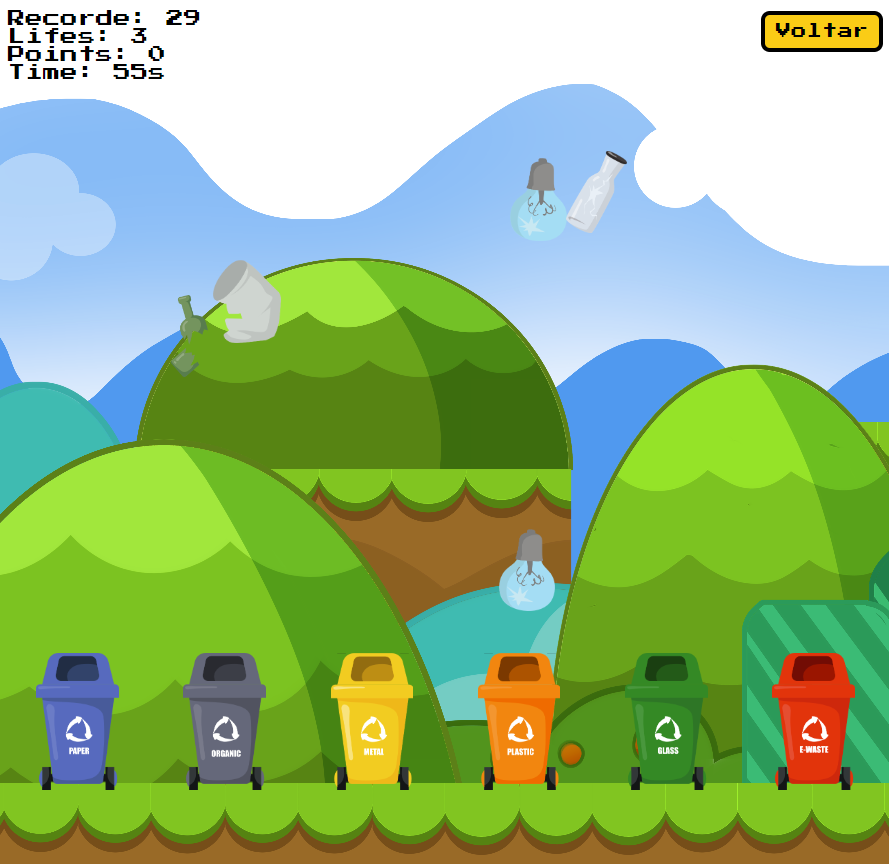

<a href="https://github.com/filipeleonelbatista/learning-to-recycle/blob/master/README_EN.md" target="_blank">
  
  Version in English
</a>
 
 

# Indice

- [Sobre](#-sobre)

## 🔖&nbsp; Sobre

Game created to train skills using only pure HTML CSS and JS to teach children in a playful way how to separate trash.

[Link do Site](https://filipeleonelbatista.github.io/learning-to-recycle/)

---

<h3 align="center" >Vamos nos conectar 😉</h3>

  &ensp;
  &ensp;
  

 

    Desenvolvido 💜 por Filipe Batista 

